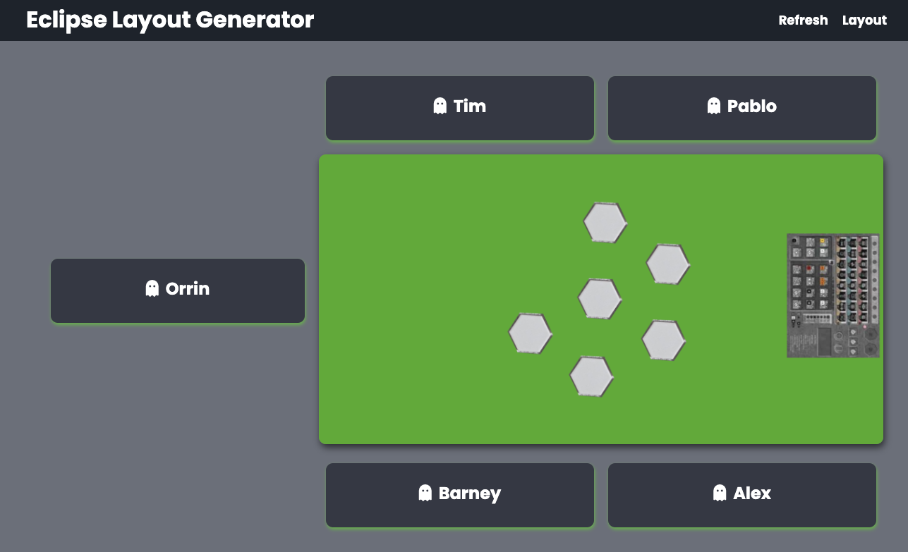

# Eclipse Setup Generator

This is a react app building on the earlier [eclipse setup](https://github.com/pablisch/eclipse-game-setup) app which I made for the purpose: 
* practicing React, in addition to JavaScript, HTML and CSS
* transposing a vanilla JavaScript project into React
* providing a simple app randomising the start setup of the board game Eclipse by:
  * randomising seating positions
  * randomising gaps between players

Other start parameters remain decided by a die roll, i.e. the highest die roll decides the starting player, and species are chosen by the players in reverse order of play.
It would be easy enough to include these features into the app but the physical act of die rolling is a part of the game so they were purposefully excluded.

## Getting Started

1. Clone the repository.
2. Run `npm install` to install dependencies.
3. Any additinal regular players may be entered into the `regularPlayerList` on line 8 of `App.js`.
4. Run `npm start` in the terminal to start the server.
5. The app will open in the browser at `localhost:3000` by default.
6. Check or uncheck any regular players as required
7. Enter any additional players using the form provided.
8. When ready, press the `Generate Game Layout` button in the navbar.

The app will randomly assign seating positions and any gaps between players.

1. There is an `Allow Regeneration` option which, after confirmation, will allow the setup to be generated again. The player settings are deliberatly left unchanged but may be manually edited before regeneration.

Refreshing the page will reset any player selections.

## Example use

* Above the players' names are arranged around the table.
* In this five player example, the void space is indicated between Tim and Orrin.

## Planned Improvements

Whilst the app works fine and does what it is supposed to do, there are a few changes that I would like to make in the future:
1. The app uses different images for each layout and I would like to make it so that the table image remains constant and there is one layout image for each player count that is rotated to match the possible layouts.
2. Create a database to store the players' names which may be added, edited or deleted. Stored names can be selected from a selctor or checkboxes on the configuration page.
3. Ability to store the generated layout in the database for historical records.
